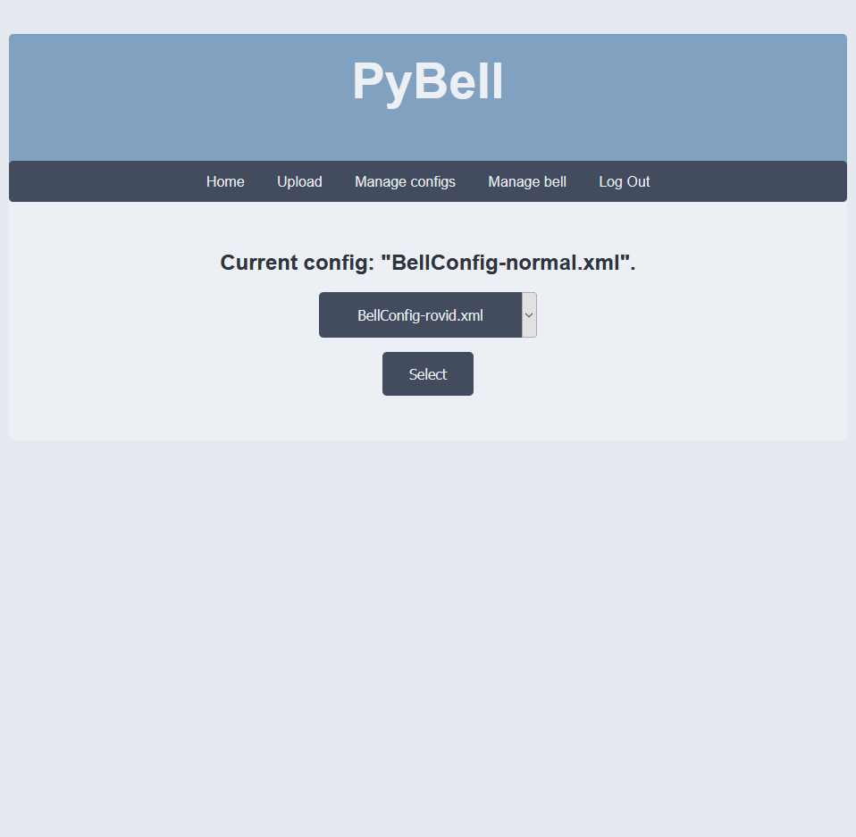
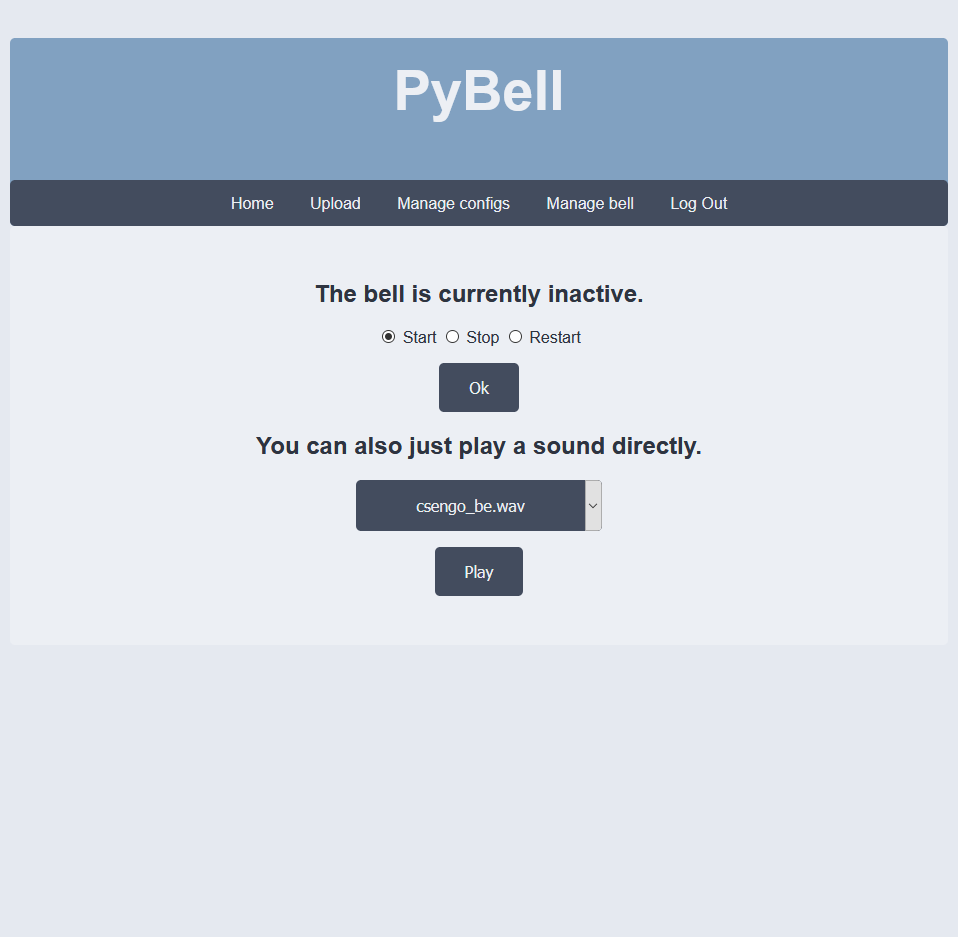

# PyBell
It's a school bell program. 🛎

## Run
After you have a working flask installed on your machine, starting PyBell is very simple.
You just have to write `flask run` into the terminal and you're pretty much good to go.

## Issues
You might encounter some issues during the first start.
In case you have a missing dependency, try `pip install -r requirements.txt`.

## Default login credentials
You need to log in to access the pages.
By default, it is done by writing 'admin' to both the username and the password field.

## Screenshots

