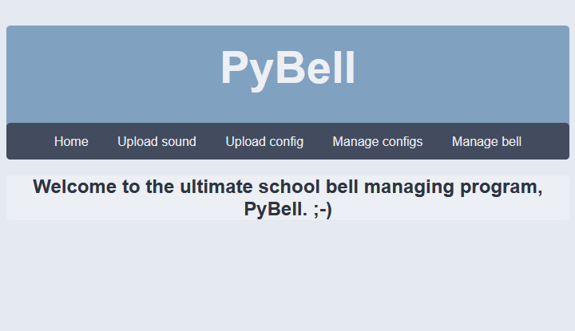
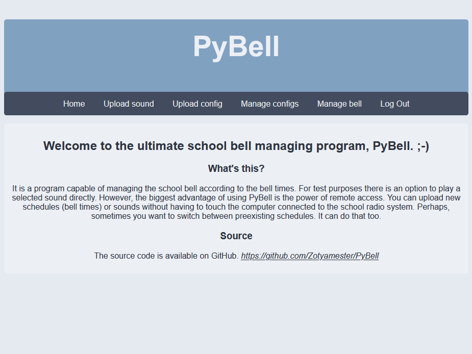
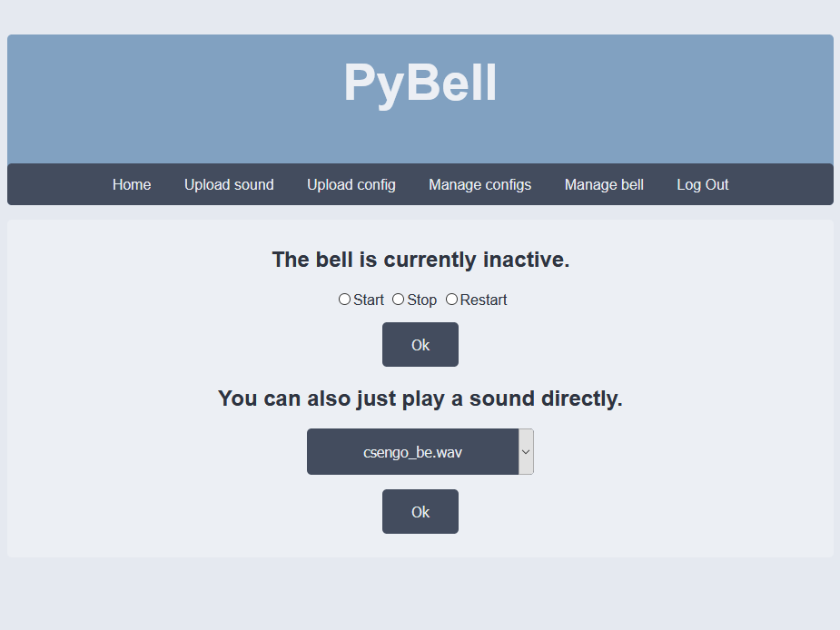

# PyBell
It's a school bell program. 🛎

## Run
After you have a working flask installed on your machine, starting PyBell is very simple.
You just have to write `flask run` into the terminal and you're pretty much good to go.

## Issues
You might run into issues during the first start. In case you have a missing dependency,
try `pip install -r requirements.txt`.

## Screenshots

